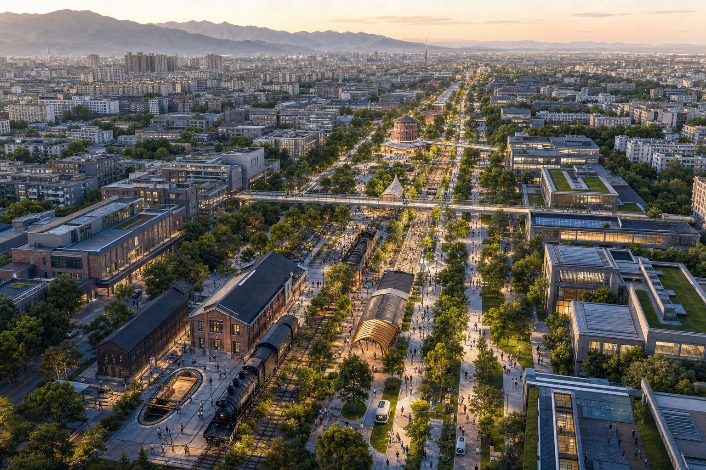
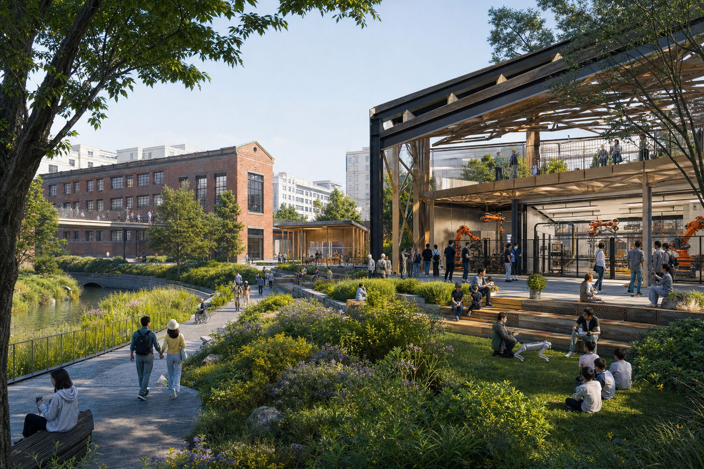
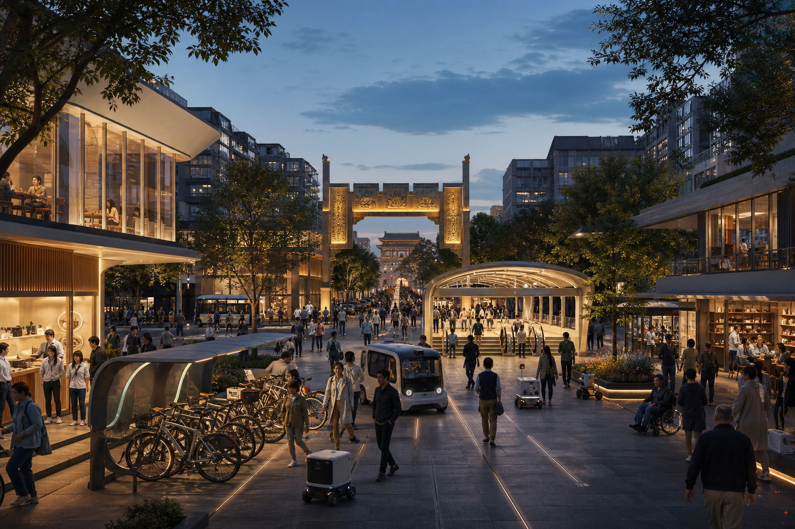

# 人类新轨：从百年京张到智能文明

> 一百年前，京张铁路回答中国如何进入现代文明；一百年后，海淀要回答人类如何进入智能文明。`THE NEXT TRACK OF HUMANITY` 不把 AI 创新带理解为企业和算力的集聚区，而把它设计成全球第一个以真实城市为载体、以人的全面发展为价值目标、以可验证和可退出为治理底线的人机共生文明原型。所有空间落地均为概念建议、参考方案或可供专业团队深化研究，不替代正式规划，不构成政府审定或实施承诺。

**百年京张，为中国现代化铺轨；未来海淀，为人类智能文明引路。**

## 设计依据与资料清单

方案以官方公告的三层范围、三处重点区和设计任务为任务依据 [source:OFFICIAL-ANNOUNCEMENT] [standard:PROJECT-OFFICIAL-ANNOUNCEMENT]，以面向智能体任务书的三大定位、五大功能、三区两翼和六项任务为共创边界 [source:AGENT-TASKBOOK] [standard:PROJECT-AGENT-OPEN-CALL-TASKBOOK]。本地 site package 是枚举、范围、标准、schema 与 allowed design space 的统一入口 [source:SITE-PACKAGE]，处理后的 fact pack 只作为任务导航、不替代原始来源 [source:PROCESSED-FACT-PACK]。用地语义遵循公开分类指南 [standard:MNR-LAND-USE-CLASSIFICATION-GUIDE]，公共空间、风貌和建筑关系参考城市设计管理要求 [standard:MOHURD-URBAN-DESIGN-MEASURES]；控规和建筑深度条目用于列出应答内容与待补资料，不被误写为已批准条件 [standard:MOHURD-CONTROL-DETAILED-PLANNING] [standard:MOHURD-ARCH-DESIGN-DEPTH-2016] [depth:existing_conditions_diagnosis]。

权威顺序为 GeoJSON、metrics、三类矩阵、manifest/来源/假设、正文、五张证据图、PDF 与离线网页。当前官方精确红线缺失，故 [data:geometry/site_boundary.geojson#SITE-001] 和三处 KEY_AREA 均是 `provisional_constraint`；11.41 平方公里仅为粗略 polygon 复算值 [metric:site_area_sqm]，不能作为官方红线、审批或精确面积依据。`sources.json` 登记任务/标准资料、provisional geometry、7 条国际案例公开来源，以及 1 条仅作低对比度环境底图的 OpenStreetMap 开放数据来源；`assumptions.json` 明确官方 polygon、控规、权属、工程和隐私评估缺口 [source:SOURCE-REGISTRY] [source:BOUNDARY-SOURCE] [source:KEY-AREA-SOURCE] [source:OSM-CONTEXT]。

## 三层范围工作框架

统筹研究范围（43.6 平方公里）回答“海淀 AI 生态如何与区域创新网络协同”；总体设计范围（公告约 11.4 平方公里）回答“遗址公园周边的产业、生活、慢行和公共空间怎样形成一体化结构”；重点区域范围（公告合计约 368.4 公顷）回答“三处锚点如何形成可深化的小方案”。三层由战略到空间再到运营逐级落地 [depth:three_level_scope_framework] [depth:overall_spatial_structure]。

总体结构为“一轴、三原型、两翼、五地标、十四场景”。一轴是把铁路文明、工程文明、中关村知识文明、人工智能革命和人机共生文明串联起来的“文明跃迁轴”；三原型是众智园“新智能诞生地”、AI 原点社区“新人类能力生长地”和大钟寺“新生活进入城市的大门”；中关村全球创新翼提供资本、法务、IP、采购、标准和国际合作，小月河城市生命翼承载生态、健康、韧性和社区日常。五个文明地标把宏大叙事转译为可到达的公共空间，十四个城市原型场景把价值主张转译为可测试、可评估、可退出的行动。以上均是组织任务、空间和运营的概念关系，不是新增红线；替换 official polygons 后须重建 land_use、roads、green/public space、buildings、phasing 和全部面积指标。

## 统筹研究范围产业与未来城市研究

### 品牌与识别系统

主名称“人类新轨”把百年铁路的物质轨道提升为智能文明的价值轨道；英文名 `THE NEXT TRACK OF HUMANITY` 直接表达海淀面向全球提出方向性命题。标识以两条从历史汇入未来的轨线构成开放门形：一条是京张铁路的工程记忆，一条是人机共生的文明新轨；五个发光节点对应人的发展、公共智能、可信治理、共同创造和地球共生。色彩使用京张炭黑、文明曙光金、海淀知识蓝、生命青绿与人本暖白；字体仅使用开源或系统可用字形，禁止套用企业商标。导视采用“里程 + 年代 + 文明问题”的语法，让每一段步行都同时指向历史事件、当代场景和未来议题 [standard:PROJECT-AGENT-OPEN-CALL-TASKBOOK]。

### 五条文明新轨

1. **人的发展轨**：从机器替代和效率优先，转向教育、健康、创造力、无障碍和人的自由时间。
2. **公共智能轨**：从少数机构独占智能，转向可负担、可共享、可进入的公共智能基础设施。
3. **可信治理轨**：从算法黑箱，转向明示 AI、数据最小化、独立验证、人工复核、申诉纠错和自由退出。
4. **共同创造轨**：从人与机器竞争，转向人确定价值和责任、AI 扩展认知与创造、机器人承担危险和重复工作。
5. **地球共生轨**：从消耗型城市，转向能够感知资源、学习反馈、修复生态并接受公共监督的城市生命系统。

### 七个国际生态案例与可转化机制

| 案例 | 公开机制 | 京张转译 |
| --- | --- | --- |
| 新加坡 one-north [source:CASE-ONE-NORTH] | 研究、企业、孵化和生活混合，并把城市作为测试环境 | 建立“验证许可证 + 公开评测 + 退出条件”三联单 |
| 巴黎 STATION F [source:CASE-STATION-F] | 多项目共用校园、投资人与社区活动密集编排 | 把原点社区设为多运营方共享的开源转化前厅 |
| 伦敦 Knowledge Quarter [source:CASE-KNOWLEDGE-QUARTER] | 文化、科研、地方政府和社区成员制协作 | 组建年度成员议程，不另造封闭管理边界 |
| 剑桥 Kendall Square [source:CASE-KENDALL-SQUARE] | 旧工业区更新为科研、商业、住房和公共空间混合社区 | 以首层公共界面和小团队可负担空间约束大体量开发倾向 |
| 多伦多 MaRS [source:CASE-MARS] | 锚点机构连接大学、医疗、资本、创业与活动 | 中关村服务翼提供一站式 IP、法务、采购和国际落地导航 |
| 蒙特利尔 Mila [source:CASE-MILA] | 研究、人才、负责任 AI 与产业转化并重 | 众智园将安全评测、伦理讨论与研发验证并置 |
| 巴塞罗那 22@ [source:CASE-22BARCELONA] | 生产性更新、公共空间、知识产业和社区设施耦合 | 用小尺度可逆更新与公共收益回路连接产业升级和居民日常 |

案例只支持机制比较，不证明本项目的规模、投资或政策已获批准。方案把既有六步闭环升级为“基础研究 - 自主技术 - 开放验证 - 场景采购 - 企业成长 - 公共体验 - 文明贡献归档”七步生态：价值不只以企业数量和融资额衡量，还以公共能力增长、普惠可达、责任事件闭环、城市碳效和开放贡献衡量。每一环既有空间载体，也有运营记录、人工问责点和退出条件 [depth:industry_space_program]。

## 总体设计范围城市更新与控规深度城市设计

用地分区完整覆盖提交边界 [data:geometry/land_use.geojson#LU-001] [depth:land_use_layout]，但只表达“研发创新、绿地开敞、产业商业、社区配套”四类设计语义，不等同法定用地。城市形态采用“开放校园 + 连续公共首层 + 蓝绿文明基底”：以遗址主轴两侧 300-500 米步行圈组织共享研发、人才服务、终身教育、夜间协作和社区设施；横向三条缝合线把清河、近校片区和大钟寺轨道门户连到主轴 [data:geometry/roads.geojson#ROAD-001]。蓝绿体验环既是生态廊道，也是低风险测试、公共学习和夏季避暑空间；绿地与公共空间概念比例分别为 12.3% 和 7.3% [metric:green_ratio] [metric:public_space_ratio]。

建筑采用“先用、再改、后建”的可逆更新序列：优先盘活首层、院落、屋顶和边角空间；通过轻型连廊、可拆卸实验舱、共享中庭、屋顶能源花园和可转换首层形成新旧共生，而不是用统一未来风格覆盖遗产和社区。只有在测绘、权属、结构、消防、文保和控规复核后，才讨论新增建筑。八个原型基底 [data:geometry/buildings.geojson#BLDG-001] 用于验证智能验证厅、终身 AI 学院、公共智能议会等空间关系，不是具体拆改留结论 [depth:retain_renovate_demolish]。容积率、总建筑面积、道路面积率和高度均保持 unknown [metric:floor_area_ratio] [metric:total_floor_area_sqm] [metric:road_area_ratio] [depth:development_intensity_controls] [depth:height_massing_character]。

## 重点区域详细设计

### 众智园 AI 自主创新加速区

定位为“新智能诞生地”，回答“人类应当创造什么样的 AI”。概念空间由自主智能验证环、机器人共工街、可信治理厅、清河地球共生花园和公众观察廊组成。全栈研发不再藏在封闭园区：芯片/框架适配、安全红队、端侧能耗、具身智能和开放标准通过分级可见界面进入公共教育；公众只能进入清权区域，核心研发、物流和访客严格分流。每个技术原型必须同时提交性能卡、能源卡、风险卡和退出卡。建筑更新坚持既有空间优先和可逆内装，任何新建体量均待专业复核 [data:geometry/key_areas.geojson#PROV-KEY-001] [depth:three_key_area_detailed_design]。

### 北京 AI 原点社区

定位为“新人类能力生长地”，回答“人与 AI 结合后，教育、研究、工作和创造如何改变”。建议把校区、园区、街区之间的断点转化为人人终身 AI 学院、开放研究院、青年共创院、社区算法诊所、贡献者拱廊和夜间知识客厅。这里不以替代岗位为目标，而以提升每个人的学习力、创造力和公共参与能力为目标；成果发布同步披露数据授权、模型卡、风险和回滚条件。人才住房与生活配套只提出混合、可负担和步行可达原则，不推定权属或具体房源。校区数据、科研成果和学生信息默认不进入公共场景 [data:geometry/key_areas.geojson#PROV-KEY-002]。

### 大钟寺 AI 产业聚集区

定位为“新生活进入城市的大门”，回答“AI 如何进入每个人的日常”。概念方案围绕轨道站四象限形成连续公共首层、未来出行客厅、AI 医疗教育法律导航站、智能产品首发厅、人工服务兜底中心和“智能文明未来之门”。所有体验必须明示 AI 身份、支持人工退出、禁止暗中画像；高影响服务只做导航和初筛，不代替医生、教师、律师或法定责任主体。连接方式仅表达步行目标与服务关系，不作桥隧或工程可行性判断 [data:geometry/key_areas.geojson#PROV-KEY-003] [metric:key_area_count]。

## AI 创新生态、人才画像与 AI+ 场景

六类用户画像分别是：开源开发者（需要协作、算力和声誉记录）、高校师生（需要低摩擦转化和学术边界）、初创团队（需要可负担空间和真实验证）、成熟企业产品团队（需要合规测试和国际发布）、周边居民及儿童长者（需要低扰动服务和清晰退出）、城市运营与专业人员（需要可审计数据和人工决策权）。每个场景采用“谁受益、在哪里、用什么数据、谁复核、如何退出、由谁维护”六问卡片。

| # | 场景卡 | 类型 / 空间 | 数据与人工边界 | 运营概念 |
| --- | --- | --- | --- | --- |
| 01 | 全栈自主智能验证中心 | **产业测试验证** / 众智园 | 合成或已授权测试集；专家签字发布 | 联合实验室轮值 |
| 02 | 城市智能体安全红队 | **产业测试验证** / 众智园治理厅 | 攻防数据隔离；高风险结果人工复核 | 预约测试 + 公开复盘 |
| 03 | 机器人与人共工街区 | **产业测试验证** / 众智园 | 地理围栏、速度限制；安全员停机权 | 分级开放 + 事故复盘 |
| 04 | 自适应无障碍慢行系统 | **产业测试验证** / 遗址主轴 | 自愿参与、模糊轨迹；规划师复核 | 居民共测日 |
| 05 | 公共 AI 与城市智能账户 | 公共基础设施 / 全带 | 最小数据、用途可见；人工柜台并行 | 公共服务目录审查 |
| 06 | 人人终身 AI 学院 | 教育 / 原点社区 | 学习数据不作商业画像；教师负责 | 免费基础课 + 进阶共学 |
| 07 | 开放研究与贡献者拱廊 | 公共创新 / 遗址主轴 | 仅展示同意公开的贡献；申诉更正 | 每周发布 + 年度归档 |
| 08 | 青年共创与低成本试验空间 | 创业服务 / 原点社区 | 科研资料分级授权；法务人工审查 | IP、采购、创业门诊 |
| 09 | 社区算法诊所与申诉中心 | 公共治理 / 社区节点 | 不收原始隐私数据；给出非 AI 渠道 | 每月公开问诊 |
| 10 | AI 医疗教育法律导航站 | 公共服务 / 大钟寺 | 只做导航和初筛；专业人士最终判断 | 服务目录动态审核 |
| 11 | 自主交通与无人配送共存环 | **产业测试验证** / 轨道门户 | 分时分区、人工接管；事件强制上报 | 监管沙盒 + 公众反馈 |
| 12 | 京张历史与未来文明导览 | 文化 / 遗址主轴 | 公开史料、无声纹识别；馆员校核 | 多语种开放内容 |
| 13 | 城市碳与水循环实时学习廊 | 生态 / 小月河翼 | 环境数据聚合；异常人工核验 | 公民科学 + 运维看板 |
| 14 | 全球智能文明大会 | 长期活动 / 一带路线 | 报名最小化；安全由人负责 | 原型交换 + 城市倡议 |

五个测试验证场景超过任务书最低 3 个要求；全部以试点建议表达，不是已批准运营。其公共空间载体对应 [data:geometry/public_space.geojson#PUBLIC-001]、慢行网络对应 [data:geometry/roads.geojson#ROAD-002]、绿色体验对应 [data:geometry/green_space.geojson#GREEN-001]。概念网络线长只用于比较路径密度 [metric:concept_network_length_m]，不得解读为施工里程。

## 用地、建筑规模与拆改留方案

四类完整分区共享边界坐标，避免重叠和空洞；它们是功能配比的讨论底图，不是控规调整。八个建筑原型总基底和概念密度分别记录在 [metric:building_footprint_area_sqm] 与 [metric:building_density]。拆改留采用五级决策门：公共价值识别 - 现状测绘 - 权属与合规 - 碳与结构评估 - 方案比选。未通过五门不得给出拆除或新建结论。风貌建议以“工业遗产的克制材料、开放首层、可识别入口、可维护遮阳与屋顶生态”为方向，避免把未来感等同镜面或大屏。

设计意图是把空间供给从一次性开发产品转为“可逆、共享、按需升级”的城市资源：研发创新分区承担工坊和验证，产业商业分区承接发布与专业服务，社区配套分区保障居民日常，公园绿地分区承担交往、生态和低风险公共测试。四者通过首层开放界面而非封闭园墙连接 [data:geometry/land_use.geojson#LU-002]。这使指标的含义从“做多少建筑”转为“有多少空间能够被不同人群在不同时段共同使用”，并为后续专业团队校准业态、首层比例和运营时段提供结构。

建筑图层的八个小体量只用于检验空间关系和原型容量 [data:geometry/buildings.geojson#BLDG-008]，不对应已核实现状建筑。每个原型都标记 `concept_reference` 类更新动作与法律提示；一旦取得现状测绘、房屋安全、消防、文保、权属和正式控规，须逐栋建立“保留价值 - 改造代价 - 隐含碳 - 公共收益 - 运营可行性”比较表。当前缺少这些资料，因此总建筑面积与 FAR 保持 unknown，而不是用假定层数倒推伪精确结果 [depth:industry_space_program]。

## 交通、轨道、市政与公共服务设施

交通策略是“一条南北主轴、三条东西缝合、一个体验环”，分别服务日常通勤、跨片区连接、轨道接驳与周末体验 [depth:traffic_rail_slow_parking]。轨道站一体化只提出入口可见、连续遮蔽、无障碍、非机动车秩序和换乘信息五项绩效目标；不绘制新工程线位。市政与新型基础设施采用“边缘算力柜 + 公共数据账本 + 场景断电/回滚接口 + 传统市政人工兜底”的最小系统 [depth:municipal_new_infrastructure]。能源负荷、管线容量、消防、停车和道路能力均待专项论证。

公共服务以 15 分钟步行逻辑嵌入创新空间：开源协作不挤占社区服务，国际活动不牺牲居民安静时段，企业测试必须提供投诉、停用和修复通道。公共空间方案面积与比例来自设计图层 [metric:public_space_area_sqm]，绿地面积来自 [metric:green_space_area_sqm]；两者都需 official boundary 后复算。

## 蓝绿空间、公共空间与城市风貌

遗址公园不是景观背景，而是一条可行走的文明时间轴和“贡献可见、技术可问、错误可修”的公共界面 [depth:blue_green_public_space]。五个文明地标依次是“百年京张纪念原点”“人类智能演化长廊”“人与 AI 共同创造广场”“公共智能议会”和“大钟寺智能文明未来之门”。它们分别承担纪念、学习、创造、治理和全球发布功能，并与移动式树荫工作台、低亮度电子墨水导视、无障碍共测组件、可拆卸展示框架组成公共空间组件库。

文化叙事形成五段文明跃迁：铁路文明代表连接，工程文明代表自主建造，中关村知识文明代表思想与市场活力，人工智能革命代表认知能力扩展，人机共生文明代表新的权利、责任和共同未来。导视使用“里程 + 年代 + 文明问题”的轨道语法，但不复制历史文物图像；贡献展示重视团队、社区和维护劳动，不制造单一英雄崇拜。所有史料需由专业机构校核，所有字体、图像、商标和人物材料需清权。

## 更新项目清单、实施政策与分期计划

| 分期 | 概念项目 | 依赖条件 | 公共验收门 |
| --- | --- | --- | --- |
| 2026—2028 铺设可信底轨 | official 数据补齐、断点开放、文明轴导视、5 个受控测试、公共智能治理协议 | official polygon、交通文保核查、数据保护评估 | 可达性、明示 AI、退出机制、事故复盘 |
| 2029—2035 形成共生原型 | 三大原型区、两翼服务网络、终身 AI 学院、公共智能议会、蓝绿生命系统 | 运营主体、空间权属、消防与容量论证 | 能力增长、居民满意、场景转化、公共收益 |
| 2036—2049 输出文明标准 | 国际伙伴节点、开放标准档案、城市原型交换、全球智能文明大会 | 长期资金与治理章程另行审议 | 年度透明报告、独立评估、退出更新、全球复制 |

三期 polygon 仅表达依赖关系和学习顺序 [data:geometry/phasing.geojson#PHASE-001] [metric:phase_1_area_sqm] [metric:phase_2_area_sqm] [metric:phase_3_area_sqm] [depth:renewal_project_list] [depth:phasing_implementation]，不是土地开发时序。建议成立“人类新轨理事会”：专业团队负责空间与安全，科研和开发者社区维护开放资产，居民陪审团审看高影响场景，伦理与法律委员审查权利边界，运营方发布年度透明度报告。活动体系包括春季智能文明议题发布、夏季城市原型共测、秋季全球智能文明大会、冬季贡献与责任归档；均为概念建议。

## 指标体系、面积复算与合规矩阵

指标分三层：可复算设计指标（site、绿地、公共空间、概念建筑和网络）、任务覆盖指标（23 项 compliance、6 项标准、15 项深度）、待补官方指标（FAR、总建筑面积、道路面积率、现状与权属）。`site_area_sqm`、`green_ratio`、`public_space_ratio` 是视觉页面的机器对照字段；已知值都记录公式、源文件、置信度和假设 [depth:metrics_recalculation]。核心数值的设计含义不是追求比例本身，而是检验公共空间是否真正承载创新交往、绿色系统是否支持日常步行、原型建筑是否保持轻量可逆。

`compliance_matrix.json` 覆盖公告 1.3/1.4/1.5 与 agent.1-agent.6；`standard_matrix.json` 把标准链接到正文、图层、指标、图纸与假设；`design_depth_matrix.json` 的 15 项 complete 表示“提交证据链完整”，不等于法定条件已批准。自检必须同时通过 deterministic、spatial、visual 和 professional 四组检查。

## 风险、版权与合规说明

最高风险是把 provisional polygon 误读为官方红线；其次是把概念建筑、网络和活动误写成确定实施。为此，所有图面以低对比虚线表达 provisional boundary，正文持续使用“概念建议/参考方案/待专业深化”。约束图层当前不包含经核验的法定控制 feature，这一“空值”本身就是必须披露的数据缺口 [data:geometry/constraints.geojson#PENDING-OFFICIAL-CONTROLS]。个人信息、企业内部数据、秘密地图、商业底图、未经授权的图像/商标/字体均不进入成果。国际案例只引用公开页面，不复制其图像；五张图、离线网页与 PDF 均由本代理基于本包 GeoJSON、指标和文字生成。

`report/copyright_statement.md` 记录生成与授权边界；正式后续必须补齐官方 GIS/CAD、现状测绘、控规、权属、交通、市政、消防、文保和生态资料 [depth:risk_missing_data]。人类和专业团队保留最终判断权，任何 AI 场景必须通过伦理、安全、个人信息保护、无障碍和人工复核评估。

## 参考资料

完整来源登记见 `sources.json`，来源用途与禁止用途由 [source:SOURCE-REGISTRY] 约束。任务层引用官方公告 [source:OFFICIAL-ANNOUNCEMENT] 和清权的智能体任务书摘要 [source:AGENT-TASKBOOK]；专业方法层引用城市设计、控规、用地分类和建筑深度的本地快照 [standard:MOHURD-URBAN-DESIGN-MEASURES]；设计边界与指标生成仅使用仓库 provisional geometry [source:BOUNDARY-SOURCE] [source:KEY-AREA-SOURCE]，不以 bbox、新闻图、OSM 或商业地图推断红线。OpenStreetMap 只在图面中提供低对比度的道路、铁路、水系和用地环境参照 [source:OSM-CONTEXT]。

七个国际案例的公开页面只用于比较“混合城市、共享平台、责任治理、成员网络、公共空间和长期运营”等机制，不把国外规模、资金、政策或组织关系转写为海淀承诺。其可转化判断最终仍落到本地设计图层、指标和六项 agent 任务，而非复制案例形态。所有网页 URL、访问用途和限制已经逐条写入 `sources.json`，图面不下载或嵌入案例图片。

当 official GIS/CAD、控规、现状建筑、权属、交通、市政、消防、文保和生态资料补齐后，专业团队应先登记来源和哈希，再替换 [data:geometry/site_boundary.geojson#SITE-001] 与 KEY_AREA、重建全部设计层、以 EPSG:4548 复算指标，并重新生成五张图、HTML、A3/A0 与四类自检 [depth:metrics_recalculation]。因此本参考资料章不仅列出“读了什么”，也说明每类资料能支持什么、不能支持什么，以及资料更新如何触发整包重算。
