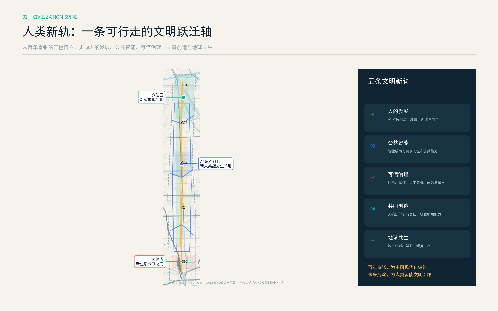
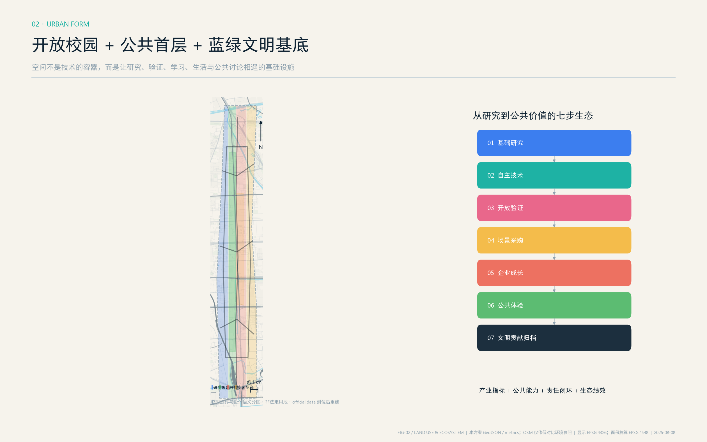
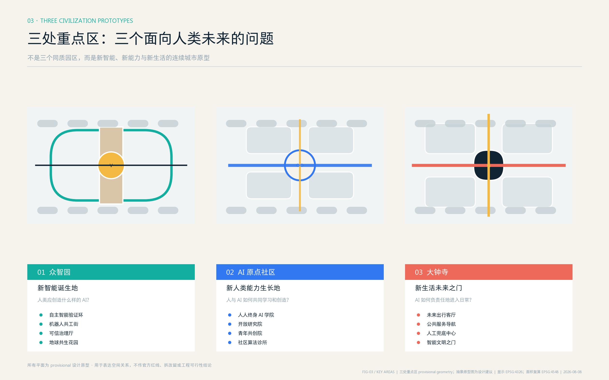
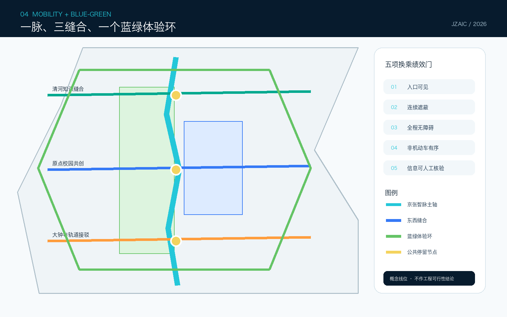
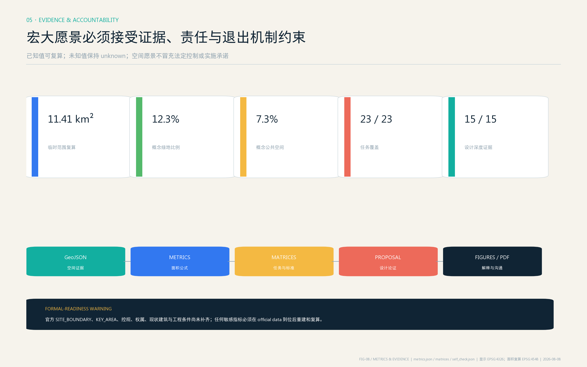

# 京张智脉：可验证城市智能公地

> JINGZHANG AI COMMONS 不是封闭“科技园”，而是一条把研发、验证、转化、生活和公共讨论接到同一条城市路径上的智能公地。所有空间落地均为概念建议、参考方案或可供专业团队深化研究，不替代正式规划，不构成政府审定或实施承诺。

## 设计依据与资料清单

方案以官方公告的三层范围、三处重点区和设计任务为任务依据 [source:OFFICIAL-ANNOUNCEMENT] [standard:PROJECT-OFFICIAL-ANNOUNCEMENT]，以面向智能体任务书的三大定位、五大功能、三区两翼和六项任务为共创边界 [source:AGENT-TASKBOOK] [standard:PROJECT-AGENT-OPEN-CALL-TASKBOOK]。本地 site package 是枚举、范围、标准、schema 与 allowed design space 的统一入口 [source:SITE-PACKAGE]，处理后的 fact pack 只作为任务导航、不替代原始来源 [source:PROCESSED-FACT-PACK]。用地语义遵循公开分类指南 [standard:MNR-LAND-USE-CLASSIFICATION-GUIDE]，公共空间、风貌和建筑关系参考城市设计管理要求 [standard:MOHURD-URBAN-DESIGN-MEASURES]；控规和建筑深度条目用于列出应答内容与待补资料，不被误写为已批准条件 [standard:MOHURD-CONTROL-DETAILED-PLANNING] [standard:MOHURD-ARCH-DESIGN-DEPTH-2016] [depth:existing_conditions_diagnosis]。

权威顺序为 GeoJSON、metrics、三类矩阵、manifest/来源/假设、正文、五张证据图、PDF 与离线网页。当前官方精确红线缺失，故 [data:geometry/site_boundary.geojson#SITE-001] 和三处 KEY_AREA 均是 `provisional_constraint`；11.41 平方公里仅为粗略 polygon 复算值 [metric:site_area_sqm]，不能作为官方红线、审批或精确面积依据。`sources.json` 登记了 5 条 formal-ready 任务/标准资料、1 条 provisional-only geometry 及 7 条国际案例公开来源；`assumptions.json` 明确官方 polygon、控规、权属、工程和隐私评估缺口 [source:SOURCE-REGISTRY] [source:BOUNDARY-SOURCE] [source:KEY-AREA-SOURCE]。

## 三层范围工作框架

统筹研究范围（43.6 平方公里）回答“海淀 AI 生态如何与区域创新网络协同”；总体设计范围（公告约 11.4 平方公里）回答“遗址公园周边的产业、生活、慢行和公共空间怎样形成一体化结构”；重点区域范围（公告合计约 368.4 公顷）回答“三处锚点如何形成可深化的小方案”。三层由战略到空间再到运营逐级落地 [depth:three_level_scope_framework] [depth:overall_spatial_structure]。

总体结构为“一脉、三核、两翼、十二场景”：一脉是京张遗址公共体验与贡献记忆主轴；三核是众智园全栈验证核、AI 原点近校转化核、大钟寺智能原生消费核；中关村科技服务翼配置资本、法务、IP 和国际服务，小月河场景赋能翼把场景测试接入日常城市。三层、三核和两翼不是新增红线，而是组织任务、空间与运营的关系图。替换 official polygons 后须重建 land_use、roads、green/public space、buildings、phasing 和全部面积指标。

## 统筹研究范围产业与未来城市研究

### 品牌与识别系统

主名称“京张智脉”保留铁路历史的线性记忆，“智脉”强调知识、人才与公共生活的循环；英文名 `JINGZHANG AI COMMONS` 避免把区域缩减成单一园区。Logo 方向取“轨道双线 + 开源括号 + 三个锚点”：两条平行线代表京张铁路与蓝绿公共轴，开放括号代表可审计的智能系统，三个圆点对应三核。色彩使用轨道深蓝、验证青、公共绿和贡献金；字体仅使用开源或系统可用字形，禁止套用企业商标。标识分为一带主品牌、三核子色和活动标签，文化导视与总体 Logo 保持区分 [standard:PROJECT-AGENT-OPEN-CALL-TASKBOOK]。

### 七个国际生态案例与可转化机制

| 案例 | 公开机制 | 京张转译 |
| --- | --- | --- |
| 新加坡 one-north [source:CASE-ONE-NORTH] | 研究、企业、孵化和生活混合，并把城市作为测试环境 | 建立“验证许可证 + 公开评测 + 退出条件”三联单 |
| 巴黎 STATION F [source:CASE-STATION-F] | 多项目共用校园、投资人与社区活动密集编排 | 把原点社区设为多运营方共享的开源转化前厅 |
| 伦敦 Knowledge Quarter [source:CASE-KNOWLEDGE-QUARTER] | 文化、科研、地方政府和社区成员制协作 | 组建年度成员议程，不另造封闭管理边界 |
| 剑桥 Kendall Square [source:CASE-KENDALL-SQUARE] | 旧工业区更新为科研、商业、住房和公共空间混合社区 | 以首层公共界面和小团队可负担空间约束大体量开发倾向 |
| 多伦多 MaRS [source:CASE-MARS] | 锚点机构连接大学、医疗、资本、创业与活动 | 中关村服务翼提供一站式 IP、法务、采购和国际落地导航 |
| 蒙特利尔 Mila [source:CASE-MILA] | 研究、人才、负责任 AI 与产业转化并重 | 众智园将安全评测、伦理讨论与研发验证并置 |
| 巴塞罗那 22@ [source:CASE-22BARCELONA] | 生产性更新、公共空间、知识产业和社区设施耦合 | 用小尺度可逆更新与公共收益回路连接产业升级和居民日常 |

案例只支持机制比较，不证明本项目的规模、投资或政策已获批准。方案的生态图谱是“基础研究 - 开源验证 - 场景采购 - 企业成长 - 公共体验 - 贡献归档”六步闭环：每一环既有空间载体，也有运营记录和人工问责点 [depth:industry_space_program]。

## 总体设计范围城市更新与控规深度城市设计

用地分区完整覆盖提交边界 [data:geometry/land_use.geojson#LU-001] [depth:land_use_layout]，但只表达“研发创新、绿地开敞、产业商业、社区配套”四类设计语义，不等同法定用地。建议以遗址主轴两侧 300-500 米步行圈组织共享研发、人才服务、夜间协作和社区设施；横向三条缝合线把清河、近校片区和大钟寺轨道接驳连到主轴 [data:geometry/roads.geojson#ROAD-001]。蓝绿体验环把可达、可停留、可测试和可避暑的公共空间串联，绿地与公共空间概念比例分别为 12.3% 和 7.3% [metric:green_ratio] [metric:public_space_ratio]。

建筑采用“先用、再改、后建”的可逆更新序列：优先盘活首层、院落、屋顶和边角空间；只有在测绘、权属、结构、消防、文保和控规复核后，才讨论新增建筑。八个原型基底 [data:geometry/buildings.geojson#BLDG-001] 用于验证全栈工坊、开源转化院、社区算法诊所等空间关系，不是具体拆改留结论 [depth:retain_renovate_demolish]。容积率、总建筑面积、道路面积率和高度均保持 unknown [metric:floor_area_ratio] [metric:total_floor_area_sqm] [metric:road_area_ratio] [depth:development_intensity_controls] [depth:height_massing_character]。

## 重点区域详细设计

### 众智园 AI 自主创新加速区

定位为“可参观的全栈验证园”。概念空间结构是清河公共界面、验证工坊组团、治理开放厅和低碳交流花园四部分；全栈验证不只展示模型，还把芯片/框架适配、安全红队、端侧能耗和标准讨论变成预约式公共课程。慢行接入清河知识缝合线，物流与访客分流作为后续交通专项输入。建筑更新坚持既有空间优先与可逆内装，任何新建体量均待专业复核 [data:geometry/key_areas.geojson#PROV-KEY-001] [depth:three_key_area_detailed_design]。

### 北京 AI 原点社区

定位为“从论文到公共价值的一公里社区”。建议把校区、园区、街区之间的断点转化为开源发布厅、近校共创厅、成果转化驿站和夜间学习客厅；成果发布同时披露数据授权、模型卡、风险和回滚条件。人才住房与生活配套只提出混合与步行可达原则，不推定权属或具体房源。校区数据、科研成果与学生信息默认不进入公共场景 [data:geometry/key_areas.geojson#PROV-KEY-002]。

### 大钟寺 AI 产业聚集区

定位为“智能原生产品进入真实城市的前厅”。概念方案围绕轨道站四象限形成连续首层、非机动车秩序、国际路演客厅和生活实验室；智能体、终端与内容消费体验必须明示 AI 身份、支持人工退出、禁止暗中画像。连接方式仅表达步行目标与服务关系，不作桥隧或工程可行性判断 [data:geometry/key_areas.geojson#PROV-KEY-003] [metric:key_area_count]。

## AI 创新生态、人才画像与 AI+ 场景

六类用户画像分别是：开源开发者（需要协作、算力和声誉记录）、高校师生（需要低摩擦转化和学术边界）、初创团队（需要可负担空间和真实验证）、成熟企业产品团队（需要合规测试和国际发布）、周边居民及儿童长者（需要低扰动服务和清晰退出）、城市运营与专业人员（需要可审计数据和人工决策权）。每个场景采用“谁受益、在哪里、用什么数据、谁复核、如何退出、由谁维护”六问卡片。

| # | 场景卡 | 类型 / 空间 | 数据与人工边界 | 运营概念 |
| --- | --- | --- | --- | --- |
| 01 | 全栈兼容验证工坊 | **产业测试验证** / 众智园 | 合成或已授权测试集；专家签字发布 | 联合实验室轮值 |
| 02 | 城市智能体红队广场 | **产业测试验证** / 众智园开放厅 | 攻防数据隔离；高风险结果人工复核 | 预约测试 + 公开复盘 |
| 03 | 端侧能耗与韧性赛道 | **产业测试验证** / 蓝绿体验环 | 设备遥测最小化；安全员停机权 | 季度挑战 + 标准沉淀 |
| 04 | 无障碍慢行共测 | **产业测试验证** / 遗址主轴 | 自愿参与、模糊轨迹；规划师复核 | 居民共测日 |
| 05 | 开源发布与贡献墙 | 公共创新 / 原点社区 | 仅展示同意公开的贡献；申诉更正 | 每周发布、年度归档 |
| 06 | 近校成果转化驿站 | 企业服务 / 原点社区 | 科研资料分级授权；法务人工审查 | IP、采购、创业门诊 |
| 07 | 社区算法诊所 | 公共服务 / 社区节点 | 不收原始隐私数据；给出非 AI 渠道 | 每月公开问诊 |
| 08 | 京张历史语音导览 | 文化 / 遗址主轴 | 公开史料、无声纹识别；馆员校核 | 多语种开放内容 |
| 09 | 清河低碳创新廊 | 生态 / 众智园界面 | 环境数据聚合；异常人工核验 | 季节性公民科学 |
| 10 | 大钟寺智能原生客厅 | 消费商务 / 大钟寺 | 明示生成内容、禁止隐性画像 | 产品首发 + 人工客服 |
| 11 | AI+生活服务样板街 | 医疗教育法律生活 / 社区商业界面 | 只做导航和初筛；专业人士作最终判断 | 服务目录动态审核 |
| 12 | 全球 AI Commons Week | 长期活动 / 一带路线 | 活动报名最小化；安全由人负责 | 展示、论坛、共测、转化 |

四个测试验证场景超过任务书最低 3 个要求；全部以试点建议表达，不是已批准运营。其公共空间载体对应 [data:geometry/public_space.geojson#PUBLIC-001]、慢行网络对应 [data:geometry/roads.geojson#ROAD-002]、绿色体验对应 [data:geometry/green_space.geojson#GREEN-001]。概念网络线长只用于比较路径密度 [metric:concept_network_length_m]，不得解读为施工里程。

## 用地、建筑规模与拆改留方案

四类完整分区共享边界坐标，避免重叠和空洞；它们是功能配比的讨论底图，不是控规调整。八个建筑原型总基底和概念密度分别记录在 [metric:building_footprint_area_sqm] 与 [metric:building_density]。拆改留采用五级决策门：公共价值识别 - 现状测绘 - 权属与合规 - 碳与结构评估 - 方案比选。未通过五门不得给出拆除或新建结论。风貌建议以“工业遗产的克制材料、开放首层、可识别入口、可维护遮阳与屋顶生态”为方向，避免把未来感等同镜面或大屏。

设计意图是把空间供给从一次性开发产品转为“可逆、共享、按需升级”的城市资源：研发创新分区承担工坊和验证，产业商业分区承接发布与专业服务，社区配套分区保障居民日常，公园绿地分区承担交往、生态和低风险公共测试。四者通过首层开放界面而非封闭园墙连接 [data:geometry/land_use.geojson#LU-002]。这使指标的含义从“做多少建筑”转为“有多少空间能够被不同人群在不同时段共同使用”，并为后续专业团队校准业态、首层比例和运营时段提供结构。

建筑图层的八个小体量只用于检验空间关系和原型容量 [data:geometry/buildings.geojson#BLDG-008]，不对应已核实现状建筑。每个原型都标记 `concept_reference` 类更新动作与法律提示；一旦取得现状测绘、房屋安全、消防、文保、权属和正式控规，须逐栋建立“保留价值 - 改造代价 - 隐含碳 - 公共收益 - 运营可行性”比较表。当前缺少这些资料，因此总建筑面积与 FAR 保持 unknown，而不是用假定层数倒推伪精确结果 [depth:industry_space_program]。

## 交通、轨道、市政与公共服务设施

交通策略是“一条南北主轴、三条东西缝合、一个体验环”，分别服务日常通勤、跨片区连接、轨道接驳与周末体验 [depth:traffic_rail_slow_parking]。轨道站一体化只提出入口可见、连续遮蔽、无障碍、非机动车秩序和换乘信息五项绩效目标；不绘制新工程线位。市政与新型基础设施采用“边缘算力柜 + 公共数据账本 + 场景断电/回滚接口 + 传统市政人工兜底”的最小系统 [depth:municipal_new_infrastructure]。能源负荷、管线容量、消防、停车和道路能力均待专项论证。

公共服务以 15 分钟步行逻辑嵌入创新空间：开源协作不挤占社区服务，国际活动不牺牲居民安静时段，企业测试必须提供投诉、停用和修复通道。公共空间方案面积与比例来自设计图层 [metric:public_space_area_sqm]，绿地面积来自 [metric:green_space_area_sqm]；两者都需 official boundary 后复算。

## 蓝绿空间、公共空间与城市风貌

遗址公园不是景观背景，而是“贡献可见、技术可问、错误可修”的公共界面 [depth:blue_green_public_space]。三处 AI 朝圣/荣誉节点为：北端“全栈验证灯塔”（展示公开评测方法而非企业排名）；中段“开源贡献者拱廊”（记录可核验的代码、标准与公共服务贡献并允许更正）；南端“大钟寺未来产品前厅”（明示 AI、人工退出和公共反馈）。三者与移动式树荫工作台、低亮度电子墨水导视、无障碍共测组件、可拆卸展示框架组成公共空间组件库。

文化叙事分三层：京张铁路代表连接、工程与公共记忆；中关村代表自主探索、开源协作与成果转化；AI 新文化强调可解释、可质疑、可修正。导视使用轨道里程语法，但不复制历史文物图像；贡献展示重视团队、社区和维护劳动，不制造单一英雄崇拜。所有史料需由专业机构校核，所有字体、图像、商标和人物材料需清权。

## 更新项目清单、实施政策与分期计划

| 分期 | 概念项目 | 依赖条件 | 公共验收门 |
| --- | --- | --- | --- |
| 连接与开放验证 | 断点清单、遗址主轴导视、4 个受控测试、贡献档案原型 | official polygon、交通与文保核查、数据保护评估 | 可达性、退出机制、事故复盘 |
| 生态编排与片区协同 | 三核共享空间、两翼服务目录、社区算法诊所、年度 Commons Week | 运营主体、空间权属、消防与容量论证 | 居民满意、场景转化、公共收益 |
| 国际网络与长期运营 | 国际伙伴节点、开放标准档案、城市级案例交换 | 长期资金与治理章程另行审议 | 年度公开报告、独立评估、退出更新 |

三期 polygon 仅表达依赖关系和学习顺序 [data:geometry/phasing.geojson#PHASE-001] [metric:phase_1_area_sqm] [metric:phase_2_area_sqm] [metric:phase_3_area_sqm] [depth:renewal_project_list] [depth:phasing_implementation]，不是土地开发时序。建议成立轻量“Commons Stewardship”协调机制：专业团队负责空间与安全，开发者社区维护开源资产，居民陪审团审看高影响场景，运营方发布年度透明度报告。活动体系包括春季模型与城市挑战、夏季公共共测、秋季全球 AI Commons Week、冬季贡献归档；均为概念建议。

## 指标体系、面积复算与合规矩阵

指标分三层：可复算设计指标（site、绿地、公共空间、概念建筑和网络）、任务覆盖指标（23 项 compliance、6 项标准、15 项深度）、待补官方指标（FAR、总建筑面积、道路面积率、现状与权属）。`site_area_sqm`、`green_ratio`、`public_space_ratio` 是视觉页面的机器对照字段；已知值都记录公式、源文件、置信度和假设 [depth:metrics_recalculation]。核心数值的设计含义不是追求比例本身，而是检验公共空间是否真正承载创新交往、绿色系统是否支持日常步行、原型建筑是否保持轻量可逆。

`compliance_matrix.json` 覆盖公告 1.3/1.4/1.5 与 agent.1-agent.6；`standard_matrix.json` 把标准链接到正文、图层、指标、图纸与假设；`design_depth_matrix.json` 的 15 项 complete 表示“提交证据链完整”，不等于法定条件已批准。自检必须同时通过 deterministic、spatial、visual 和 professional 四组检查。

## 风险、版权与合规说明

最高风险是把 provisional polygon 误读为官方红线；其次是把概念建筑、网络和活动误写成确定实施。为此，所有图面以低对比虚线表达 provisional boundary，正文持续使用“概念建议/参考方案/待专业深化”。约束图层当前不包含经核验的法定控制 feature，这一“空值”本身就是必须披露的数据缺口 [data:geometry/constraints.geojson#PENDING-OFFICIAL-CONTROLS]。个人信息、企业内部数据、秘密地图、商业底图、未经授权的图像/商标/字体均不进入成果。国际案例只引用公开页面，不复制其图像；五张图、离线网页与 PDF 均由本代理基于本包 GeoJSON、指标和文字生成。

`report/copyright_statement.md` 记录生成与授权边界；正式后续必须补齐官方 GIS/CAD、现状测绘、控规、权属、交通、市政、消防、文保和生态资料 [depth:risk_missing_data]。人类和专业团队保留最终判断权，任何 AI 场景必须通过伦理、安全、个人信息保护、无障碍和人工复核评估。

## 参考资料

完整来源登记见 `sources.json`，来源用途与禁止用途由 [source:SOURCE-REGISTRY] 约束。任务层引用官方公告 [source:OFFICIAL-ANNOUNCEMENT] 和清权的智能体任务书摘要 [source:AGENT-TASKBOOK]；专业方法层引用城市设计、控规、用地分类和建筑深度的本地快照 [standard:MOHURD-URBAN-DESIGN-MEASURES]；空间生成层仅使用仓库 provisional geometry [source:BOUNDARY-SOURCE] [source:KEY-AREA-SOURCE]，不用 bbox、新闻图、OSM 或商业地图推断红线。

七个国际案例的公开页面只用于比较“混合城市、共享平台、责任治理、成员网络、公共空间和长期运营”等机制，不把国外规模、资金、政策或组织关系转写为海淀承诺。其可转化判断最终仍落到本地设计图层、指标和六项 agent 任务，而非复制案例形态。所有网页 URL、访问用途和限制已经逐条写入 `sources.json`，图面不下载或嵌入案例图片。

当 official GIS/CAD、控规、现状建筑、权属、交通、市政、消防、文保和生态资料补齐后，专业团队应先登记来源和哈希，再替换 [data:geometry/site_boundary.geojson#SITE-001] 与 KEY_AREA、重建全部设计层、以 EPSG:4548 复算指标，并重新生成五张图、HTML、A3/A0 与四类自检 [depth:metrics_recalculation]。因此本参考资料章不仅列出“读了什么”，也说明每类资料能支持什么、不能支持什么，以及资料更新如何触发整包重算。
